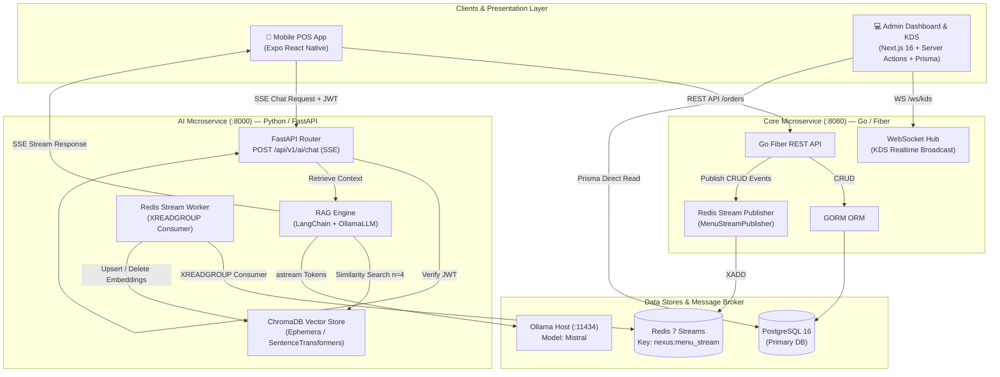

# Nexus — Smart POS & AI Order Assistant

> **Enterprise Polyglot Microservices:** High-Concurrency POS Core (Go) + Event-Driven Vector RAG Pipeline (Python/FastAPI) + Realtime KDS (Next.js) + Mobile POS Client (Expo React Native)

[](https://go.dev/)
[](https://www.python.org/)
[](https://fastapi.tiangolo.com/)
[](https://nextjs.org/)
[](https://expo.dev/)
[](https://www.trychroma.com/)
[](https://redis.io/)
[](https://www.postgresql.org/)
[](#automated-test-suite)

---

## 💡 Why Nexus? (Problem Statement & Solution)

Traditional Point of Sale (POS) systems are rigid database wrappers. They struggle during peak hours due to monolithic bottlenecks and lack intelligent, contextual customer assistance.

**Nexus** solves this by separating transactional workloads from AI processing:
- **Zero-Latency Ordering:** A lightweight, compiled **Go Core Service** handles orders, menu CRUD, and payment webhooks with minimal overhead.
- **Instant Kitchen Dispatch:** Orders are pushed via **In-Memory WebSockets** to the Kitchen Display System (KDS) instantly upon checkout.
- **Event-Driven AI Sync:** Menu updates in the Go core automatically emit **Redis Streams** events (`nexus:menu_stream`). A Python worker consumes these events to update vector embeddings in **ChromaDB** in real time.
- **Context-Aware AI Assistant:** Customers and cashiers query menu items, dietary tags, and recommendations using a local **LangChain + Ollama RAG pipeline** delivered via **Server-Sent Events (SSE)**.

---

## 🎬 System Showcase & Flow

```
┌─────────────────┐       ┌─────────────────┐       ┌─────────────────┐
│   Mobile POS    │ ───►  │  Realtime KDS   │ ───►  │ RAG AI Assistant│
│  Customer App   │       │ Kitchen Display │       │   SSE Stream    │
└─────────────────┘       └─────────────────┘       └─────────────────┘
```

| Component | Interface | Description |
|---|---|---|
| **Mobile POS** | Expo React Native | Table number entry, menu selection, basket management, QRIS payment screen |
| **Admin & KDS** | Next.js 16 Dashboard | Realtime order Kanban board (`pending` → `preparing` → `ready` → `done`), menu manager, dynamic sales analytics |
| **AI Assistant** | FastAPI SSE Endpoint | Natural language queries on menu ingredients, prices, and recommendations using local LLM |

---

## 📐 Architecture Overview

Nexus utilizes a **polyglot microservices pattern** with event-driven data replication and cross-service JWT authentication:



---

## 🤖 AI Engineering & Design Decisions

### 1. RAG (Retrieval-Augmented Generation) vs. Fine-Tuning
- **Decision:** Use RAG over Fine-Tuning.
- **Rationale:** Menu prices, stock availability (`is_available`), and seasonal items change frequently. Fine-tuning an LLM for every price update is computationally prohibitive and prone to hallucinating outdated prices. RAG guarantees that vector search fetches the exact up-to-date context from **ChromaDB** before passing it to the prompt.

### 2. Local Ollama (Mistral) vs. Cloud LLM APIs (OpenAI/Claude)
- **Decision:** Use local Ollama instance running `mistral`.
- **Rationale:** 
  - **Data Privacy & Cost:** In-restaurant POS queries do not incur per-token cloud API costs.
  - **Network Resilience:** Local LLM inference functions even if external internet connectivity drops, keeping in-restaurant operations running locally.

### 3. Vector Retrieval Strategy (`n_results=4` & Embeddings)
- **Decision:** Built-in `all-MiniLM-L6-v2` embedding function with cosine distance, retrieved top-4 items.
- **Rationale:** 4 retrieved menu documents provide optimal prompt context length for `mistral` without overwhelming the context window, keeping latency low (~50ms retrieval time).

---

## 🛠️ Tech Stack & Topology

| Service | Language / Framework | Key Libraries & Tools | Responsibilities |
|---|---|---|---|
| **Core Backend** | Go 1.25 | Fiber v2, GORM, go-redis, JWT | Transactions, Menu CRUD, WebSockets, Payment Webhooks |
| **AI Backend** | Python 3.11 / FastAPI | LangChain, OllamaLLM, ChromaDB, PyJWT, httpx | RAG pipeline, Redis Streams consumer, SSE streaming |
| **Admin & KDS** | TypeScript / Next.js 16 | React 19, Tailwind CSS v4, Prisma v7 | KDS WebSocket view, Menu Manager, Realtime Dashboard |
| **Mobile POS** | TypeScript / React Native | Expo SDK 57, Zustand, Axios | Table ordering, Cart management, QRIS simulation |
| **Databases** | PostgreSQL 16 & Redis 7 | GORM AutoMigrate, Redis Streams | Relational data persistence & durable event streaming |

---

## 🔒 Security & Cross-Service Auth

- **Shared JWT HS256 Secret:** All microservices share a symmetric JWT secret configured via environment variables.
- **Role-Based Access Control (RBAC):** Admin routes (`POST/PUT/DELETE /api/v1/menus`) require `role: admin`.
- **Protected AI Endpoint:** `POST /api/v1/ai/chat` is protected by `verify_jwt` middleware in FastAPI to prevent unauthenticated LLM token drain attacks.
- **Configurable CORS:** Allowed origins are configurable via `ALLOWED_ORIGINS` env var on both Go and FastAPI services.
- **Webhook Idempotency & Signature Verification:** Midtrans payment callback handler verifies signature keys (`SHA512`) and enforces idempotency on order state updates.

---

## 📖 API Documentation & Specifications

### Interactive Swagger / OpenAPI Docs
FastAPI automatically generates interactive API documentation:
- **Swagger UI:** `http://localhost:8000/docs`
- **ReDoc:** `http://localhost:8000/redoc`

### Key Endpoints Overview

#### Go Core Service (`:8080`)
| Method | Endpoint | Auth | Description |
|---|---|---|---|
| `POST` | `/api/v1/auth/register` | None | Register new user / staff |
| `POST` | `/api/v1/auth/login` | None | Authenticate & receive JWT |
| `GET` | `/api/v1/menus` | None | List available menus |
| `POST` | `/api/v1/menus` | Admin JWT | Create new menu item (emits Redis Stream event) |
| `PUT` | `/api/v1/menus/:id` | Admin JWT | Update menu item (emits Redis Stream event) |
| `DELETE` | `/api/v1/menus/:id` | Admin JWT | Delete menu item (emits Redis Stream event) |
| `POST` | `/api/v1/orders` | None | Submit new customer order |
| `PATCH` | `/api/v1/orders/:id/status` | None | Update status (`pending` → `preparing` → `ready` → `done`) |
| `POST` | `/api/v1/payment/callback` | Webhook Sig | Midtrans payment callback |
| `GET` | `/ws/kds` | None | WebSocket endpoint for kitchen display |

#### Python AI Service (`:8000`)
| Method | Endpoint | Auth | Description |
|---|---|---|---|
| `POST` | `/api/v1/ai/chat` | Bearer JWT | SSE streaming RAG menu assistant |
| `GET` | `/health` | None | Health check & ChromaDB document count |

---

## 🧪 Automated Test Suite

The project includes unit, integration, and state machine tests across both Go and Python services.

```bash
# Run Go Usecase Unit Tests (15 tests)
cd backend/core
go test ./usecase/... -v -count=1

# Run Python Pytest Suite (26 tests)
cd backend/ai
.\.venv\Scripts\python -m pytest tests/ -v
```

### Test Coverage Summary: 39/39 PASS ✅
- **Go Tests (15):** Menu CRUD validation, order price snapshotting, table-driven state machine transition rules (10 status state cases).
- **Python Tests (24):** ChromaDB document builder, EphemeralClient isolation, Redis stream worker message dispatcher (create/update/delete/invalid JSON handling), FastAPI JWT authentication (401 vs 200 SSE stream).

---

## ⚠️ Known Trade-offs & Engineering Limitations

Acknowledging system boundaries and architectural trade-offs:

1. **In-Memory WebSocket Hub (Single-Instance Bound)**
   - *Current Implementation:* The Go WebSocket Hub manages active client connections in memory.
   - *Trade-off:* Does not scale across multiple Go container replicas without pub/sub.
   - *Upgrade Path:* Replace in-memory hub with Redis Pub/Sub for horizontal scaling across multiple instances.

2. **Ephemeral Vector Store (In-Process ChromaDB)**
   - *Current Implementation:* ChromaDB uses `EphemeralClient` (in-memory) for zero-dependency local execution.
   - *Trade-off:* Vector index is rebuilt on startup by seeding menus from Go Core Service via HTTP GET `/api/v1/menus`.
   - *Upgrade Path:* Deploy ChromaDB as a dedicated container (`chromadb/chroma`) with persistent volume storage.

3. **Mock Payment Webhook**
   - *Current Implementation:* Local mock Midtrans client for signature verification and status settlement.
   - *Upgrade Path:* Swap mock key with actual Midtrans Sandbox Server Key in production.

---

## 🚀 Quick Start Guide

### Prerequisites
- [Docker Desktop](https://www.docker.com/) (running)
- [Go 1.21+](https://go.dev/)
- [Python 3.11+](https://www.python.org/)
- [Node.js 20+](https://nodejs.org/)
- [Ollama](https://ollama.ai/) with `mistral` model (`ollama run mistral`)

### 1. Clone & Environment Setup
```bash
git clone https://github.com/Nandapratama716/Nexus.git
cd Nexus

# Copy environment template
cp .env.example .env
```

### 2. Infrastructure (PostgreSQL & Redis)
```bash
docker compose up -d
```

### 3. Go Core Service
```bash
cd backend/core
go run cmd/api/main.go
# Server listening on http://localhost:8080
```

### 4. Python AI Service
```bash
cd backend/ai
.\.venv\Scripts\python -m pip install -r requirements.txt
.\.venv\Scripts\python -m uvicorn main:app --reload --port 8000
# Server listening on http://localhost:8000
# Swagger docs at http://localhost:8000/docs
```

### 5. Frontend Admin & KDS (Next.js)
```bash
cd frontend
npm install
npx prisma generate
npm run dev
# Dashboard at http://localhost:3000
```

### 6. Mobile POS App (Expo)
```bash
cd mobile
npm install
npm run web  # Run in browser
# or npm run start for Expo Go
```

---

## 📜 License

Distributed under the MIT License. See `LICENSE` for more information.
