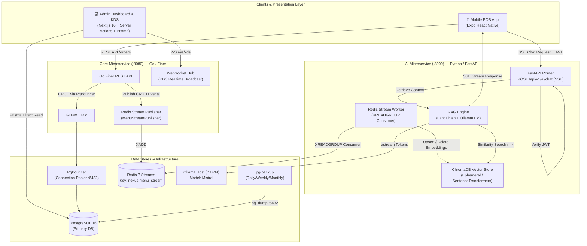

# Nexus — Smart POS & AI Order Assistant

> **Enterprise Polyglot Microservices:** High-Concurrency POS Core (Go) + Event-Driven Vector RAG Pipeline (Python/FastAPI) + Realtime KDS (Next.js) + Mobile POS Client (Expo React Native)

[](https://go.dev/)
[](https://www.python.org/)
[](https://fastapi.tiangolo.com/)
[](https://nextjs.org/)
[](https://expo.dev/)
[](https://www.trychroma.com/)
[](https://redis.io/)
[](https://www.postgresql.org/)
[](#automated-test-suite)

---

## 💡 Why Nexus? (Problem Statement & Solution)

Traditional Point of Sale (POS) systems are rigid database wrappers. They struggle during peak hours due to monolithic bottlenecks and lack intelligent, contextual customer assistance.

**Nexus** solves this by separating transactional workloads from AI processing:

- **Zero-Latency Ordering:** A lightweight, compiled **Go Core Service** handles orders, menu CRUD, and payment webhooks with minimal overhead.
- **Instant Kitchen Dispatch:** Orders are pushed via **In-Memory WebSockets** to the Kitchen Display System (KDS) instantly upon checkout, with auto-reconnect and resync-on-reconnect logic.
- **Event-Driven AI Sync:** Menu updates in the Go core automatically emit **Redis Streams** events (`nexus:menu_stream`). A Python worker consumes these events to update vector embeddings in **ChromaDB** in real time.
- **Context-Aware AI Assistant:** Customers and cashiers query menu items, dietary tags, and recommendations using a local **LangChain + Ollama RAG pipeline** delivered via **Server-Sent Events (SSE)**.
- **Production-Grade Operations:** Automated daily/weekly/monthly PostgreSQL backups via Docker, PgBouncer connection pooling, and heartbeat Ping-Pong WebSocket health monitoring.

---

## 🎬 System Showcase & Flow

```
┌─────────────────┐       ┌─────────────────┐       ┌─────────────────┐
│   Mobile POS    │ ───►  │  Realtime KDS   │ ───►  │ RAG AI Assistant│
│  Customer App   │       │ Kitchen Display │       │   SSE Stream    │
└─────────────────┘       └─────────────────┘       └─────────────────┘
         │                        │
         ▼                        ▼
 Bluetooth Thermal          WebSocket Auto-
   Printer (ESC/POS)        Reconnect + Resync
```

| Component              | Interface            | Description                                                                                                                |
| ---------------------- | -------------------- | -------------------------------------------------------------------------------------------------------------------------- |
| **Mobile POS**   | Expo React Native    | Table ordering, basket management, QRIS/Cash payment, Bluetooth thermal receipt printing, live animated order status |
| **Admin & KDS**  | Next.js 16 Dashboard | Realtime order Kanban, menu manager, floor plan editor, dynamic sales analytics, WebSocket KDS with auto-reconnect |
| **AI Assistant** | FastAPI SSE Endpoint | Natural language queries on menu ingredients, prices, and recommendations using local LLM |

---

## 📐 Architecture Overview

Nexus utilizes a **polyglot microservices pattern** with event-driven data replication and cross-service JWT authentication:



---

## 🤖 AI Engineering & Design Decisions

### 1. RAG (Retrieval-Augmented Generation) vs. Fine-Tuning

- **Decision:** Use RAG over Fine-Tuning.
- **Rationale:** Menu prices, stock availability (`is_available`), and seasonal items change frequently. Fine-tuning an LLM for every price update is computationally prohibitive and prone to hallucinating outdated prices. RAG guarantees that vector search fetches the exact up-to-date context from **ChromaDB** before passing it to the prompt.

### 2. Local Ollama (Mistral) vs. Cloud LLM APIs (OpenAI/Claude)

- **Decision:** Use local Ollama instance running `mistral`.
- **Rationale:**
  - **Data Privacy & Cost:** In-restaurant POS queries do not incur per-token cloud API costs.
  - **Network Resilience:** Local LLM inference functions even if external internet connectivity drops, keeping in-restaurant operations running locally.

### 3. Vector Retrieval Strategy (`n_results=4` & Embeddings)

- **Decision:** Built-in `all-MiniLM-L6-v2` embedding function with cosine distance, retrieved top-4 items.
- **Rationale:** 4 retrieved menu documents provide optimal prompt context length for `mistral` without overwhelming the context window, keeping latency low (~50ms retrieval time).

---

## 🛠️ Tech Stack & Topology

| Service                | Language / Framework      | Key Libraries & Tools                        | Responsibilities                                      |
| ---------------------- | ------------------------- | -------------------------------------------- | ----------------------------------------------------- |
| **Core Backend** | Go 1.25                   | Fiber v2, GORM, go-redis, JWT, golang-migrate | Transactions, Menu CRUD, WebSockets, Payment Webhooks, DB Migration |
| **AI Backend**   | Python 3.11 / FastAPI     | LangChain, OllamaLLM, ChromaDB, PyJWT, httpx | RAG pipeline, Redis Streams consumer, SSE streaming   |
| **Admin & KDS**  | TypeScript / Next.js 16   | React 19, Tailwind CSS v4, Prisma v7         | KDS WebSocket view (auto-reconnect + resync), Menu Manager, Floor Plan Editor, Realtime Dashboard |
| **Mobile POS**   | TypeScript / React Native | Expo SDK 57, Zustand, Axios, Animated API    | Table ordering, Cart, QRIS/Cash payment, Bluetooth thermal printer, Lottie-style status animations |
| **Infrastructure** | Docker Compose            | PostgreSQL 16, Redis 7, PgBouncer, pg-backup | DB, cache, connection pooling, automated backup & retention |

---

## 🔒 Security & Cross-Service Auth

- **Shared JWT HS256 Secret:** All microservices share a symmetric JWT secret configured via environment variables.
- **Role-Based Access Control (RBAC):** Admin routes (`POST/PUT/DELETE /api/v1/menus`) require `role: admin`.
- **Protected AI Endpoint:** `POST /api/v1/ai/chat` is protected by `verify_jwt` middleware in FastAPI to prevent unauthenticated LLM token drain attacks.
- **Configurable CORS:** Allowed origins are configurable via `ALLOWED_ORIGINS` env var on both Go and FastAPI services.
- **Webhook Idempotency & Signature Verification:** Midtrans payment callback handler verifies signature keys (`SHA512`) and enforces idempotency on order state updates.
- **Row-Level Security (RLS):** PostgreSQL RLS policies on all tenant tables (`orders`, `menus`, `users`) for multi-tenant data isolation.

---

## 📖 API Documentation & Specifications

### Interactive Swagger / OpenAPI Docs

FastAPI automatically generates interactive API documentation:

- **Swagger UI:** `http://localhost:8000/docs`
- **ReDoc:** `http://localhost:8000/redoc`

### Key Endpoints Overview

#### Go Core Service (`:8080`)

| Method     | Endpoint                      | Auth        | Description                                                           |
| ---------- | ----------------------------- | ----------- | --------------------------------------------------------------------- |
| `POST`   | `/api/v1/auth/register`     | None        | Register new user / staff                                             |
| `POST`   | `/api/v1/auth/login`        | None        | Authenticate & receive JWT                                            |
| `GET`    | `/api/v1/menus`             | None        | List available menus                                                  |
| `POST`   | `/api/v1/menus`             | Admin JWT   | Create new menu item (emits Redis Stream event)                       |
| `PUT`    | `/api/v1/menus/:id`         | Admin JWT   | Update menu item (emits Redis Stream event)                           |
| `DELETE` | `/api/v1/menus/:id`         | Admin JWT   | Delete menu item (emits Redis Stream event)                           |
| `POST`   | `/api/v1/orders`            | None        | Submit new customer order                                             |
| `GET`    | `/api/v1/orders/active`     | None        | Get all active orders (used by mobile live status tracker)            |
| `GET`    | `/api/v1/orders/:id`        | None        | Get single order with payment status                                  |
| `PATCH`  | `/api/v1/orders/:id/status` | None        | Update status (`pending` → `preparing` → `ready` → `done`) |
| `POST`   | `/api/v1/payment/callback`  | Webhook Sig | Midtrans payment callback (SHA512 signature verified)                 |
| `GET`    | `/ws/kds`                   | None        | WebSocket endpoint for kitchen display (supports Ping-Pong heartbeat) |

#### Python AI Service (`:8000`)

| Method   | Endpoint            | Auth       | Description                            |
| -------- | ------------------- | ---------- | -------------------------------------- |
| `POST` | `/api/v1/ai/chat` | Bearer JWT | SSE streaming RAG menu assistant       |
| `GET`  | `/health`         | None       | Health check & ChromaDB document count |

---

## 🆕 Recent Feature Additions

### Phase 1 — WebSocket Reliability (Backend)

| Feature | Description |
|---|---|
| **Auto-Reconnect + Resync** | KDS frontend reconnects every 3 seconds on disconnect; pulls full order list on `onopen` to fill gaps |
| **Heartbeat Ping-Pong** | Server sends `__ping__` every 30s; zombie connections that miss 2 pings are auto-closed |
| **Dirty Migration Recovery** | `migrator.go` auto-clears `dirty=true` flag in `schema_migrations` before retrying |

### Phase 2 — Analytics Dashboard (Frontend)

| Feature | Description |
|---|---|
| **Analitik Penjualan** | Revenue chart (7 hari / 30 hari), top menu ranking, order status breakdown |
| **Floor Plan Editor** | Drag-and-drop meja interaktif dengan status real-time (available / occupied) |

### Phase 3 — Mobile UX Polish (React Native)

| Feature | Description |
|---|---|
| **Skeleton Shimmer Loading** | Placeholder cards dengan pulse animation menggantikan `ActivityIndicator` saat fetch menu |
| **Sticky Cart Bar** | Bottom bar muncul otomatis saat ada item di keranjang, collapse saat kosong |
| **Flavor & Dietary Chips** | Filter horizontal: Pedas 🌶️, Manis 🍯, Segar/Dingin 🧊, Vegetarian 🥗 |
| **Lottie-style Status Animations** | Per-status animated icons: pulse (pending), spin (preparing), bounce (ready) via `Animated` API |
| **Bluetooth Thermal Printer** | ESC/POS via `react-native-bluetooth-classic`, persistent pairing (AsyncStorage), Android 12+ permissions, graceful fallback ke modal preview |

### Phase 4 — Operations

| Feature | Description |
|---|---|
| **PostgreSQL Backup** | Docker container `prodrigestivill/postgres-backup-local:16`, daily/weekly/monthly retention (7d/4w/3m), gzip-9 compression |
| **PgBouncer Pooling** | Transaction-mode connection pooler, `MAX_CLIENT_CONN=1000`, `DEFAULT_POOL_SIZE=20` |
| **Backup Scripts** | `scripts/backup_postgres.sh` (manual + S3 upload opsional), `scripts/restore_postgres.sh` (dengan konfirmasi `RESTORE`) |

---

## 🧪 Automated Test Suite

```bash
# Go Usecase Unit Tests (22 tests)
cd backend/core
go test ./usecase/... -v -count=1

# Python Pytest Suite
cd backend/ai
.\.venv\Scripts\python -m pytest tests/ -v
```

### Test Coverage Summary: 22/22 PASS ✅ (Go Usecase)

- **Go Tests (22):** Menu CRUD validation, order price snapshotting, promo + tax + service charge calculation, stock deduction + auto sold-out, table-driven state machine (7 transition cases), tenant isolation.

---

## ⚠️ Known Trade-offs & Engineering Limitations

1. **In-Memory WebSocket Hub (Single-Instance Bound)**
   - *Current:* WebSocket Hub manages connections in memory; includes Ping-Pong heartbeat for zombie cleanup.
   - *Upgrade Path:* Redis Pub/Sub for horizontal scaling across multiple Go replicas.

2. **Ephemeral Vector Store (In-Process ChromaDB)**
   - *Current:* `EphemeralClient` rebuilt on startup from Go Core `/api/v1/menus` seed.
   - *Upgrade Path:* `chromadb/chroma` container with persistent volume.

3. **Mock Payment Webhook**
   - *Current:* Local mock Midtrans client; simulation button in mobile app triggers `settlement` webhook.
   - *Upgrade Path:* Real Midtrans Sandbox Server Key in production.

4. **Bluetooth Printer — Android Only**
   - *Current:* `react-native-bluetooth-classic` is Android-only; iOS uses MFi/External Accessory (not implemented). Web fallback to text preview modal.
   - *Upgrade Path:* iOS MFi printer integration via `react-native-thermal-receipt-printer-image-qr`.

---

## 🚀 Quick Start Guide

### Prerequisites

- [Docker Desktop](https://www.docker.com/) (running)
- [Go 1.21+](https://go.dev/)
- [Python 3.11+](https://www.python.org/)
- [Node.js 20+](https://nodejs.org/)
- [Ollama](https://ollama.ai/) with `mistral` model (`ollama run mistral`)

### 1. Clone & Environment Setup

```bash
git clone https://github.com/Nandapratama716/Nexus.git
cd Nexus

# Copy environment template
cp .env.example .env
```

### 2. Infrastructure (PostgreSQL, Redis, PgBouncer, Backup)

```bash
docker compose up -d
# Containers: nexus-postgres, nexus-redis, nexus-pgbouncer, nexus-pgadmin, nexus-pg-backup
```

### 3. Go Core Service

```bash
cd backend/core
go run cmd/api/main.go
# Server listening on http://localhost:8080
# Auto-migration (dirty flag auto-cleared if needed)
```

### 4. Python AI Service

```bash
cd backend/ai
.\.venv\Scripts\python -m pip install -r requirements.txt
.\.venv\Scripts\python -m uvicorn main:app --reload --port 8000
# Server listening on http://localhost:8000
# Swagger docs at http://localhost:8000/docs
```

### 5. Frontend Admin & KDS (Next.js)

```bash
cd frontend
npm install
npx prisma generate
npm run dev
# Dashboard at http://localhost:3000
# KDS at http://localhost:3000/kds
```

### 6. Mobile POS App (Expo)

```bash
cd mobile
npm install
npm run web  # Run in browser
# or npm run start for Expo Go on device
```

### 7. Backup (Opsional — Aktifkan Container)

```bash
# Container backup sudah jalan via docker compose up -d
# Trigger manual backup:
docker exec nexus-pg-backup sh -c 'POSTGRES_HOST=$POSTGRES_HOST POSTGRES_DB=$POSTGRES_DB /backup.sh'

# Lihat daftar backup
docker exec nexus-pg-backup ls -lah /backups/daily/
```

---

## 📁 Project Structure

```
Nexus/
├── backend/
│   ├── core/                   # Go Fiber REST API + WebSocket Hub
│   │   ├── cmd/api/            # main.go entrypoint
│   │   ├── delivery/           # HTTP handlers, WebSocket hub
│   │   ├── domain/             # Entity definitions
│   │   ├── infrastructure/     # DB, Redis, Midtrans, Migrator
│   │   ├── migrations/         # golang-migrate SQL files
│   │   ├── repository/         # GORM repository implementations
│   │   └── usecase/            # Business logic + unit tests
│   └── ai/                     # Python FastAPI RAG service
│       ├── main.py
│       ├── routers/
│       └── tests/
├── frontend/                   # Next.js 16 Dashboard + KDS
│   └── src/app/
│       ├── dashboard/          # Analitik, floor-plan, menu manager
│       └── kds/                # Kitchen Display System
├── mobile/                     # Expo React Native POS Client
│   └── src/
│       ├── screens/            # MenuScreen, CartScreen, PaymentScreen, MyOrdersScreen
│       ├── store/              # Zustand cartStore
│       ├── utils/              # thermalReceipt.ts, useThermalPrinter.ts
│       └── components/         # AIChatModal
├── scripts/                    # Operational scripts
│   ├── backup_postgres.sh      # Manual backup + S3 upload
│   ├── restore_postgres.sh     # Restore dengan konfirmasi
│   └── BACKUP.md               # Dokumentasi strategi backup
├── docker-compose.yml          # All infra: PG, Redis, PgBouncer, pgAdmin, pg-backup
└── .env.example                # Environment template
```

---

## 📜 License

Distributed under the MIT License. See `LICENSE` for more information.
